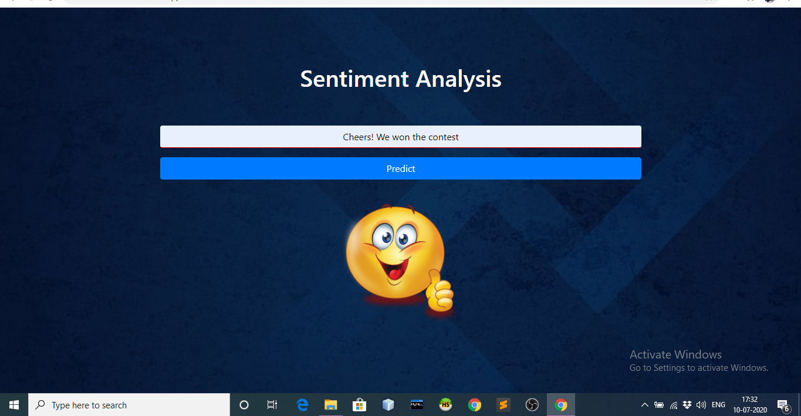
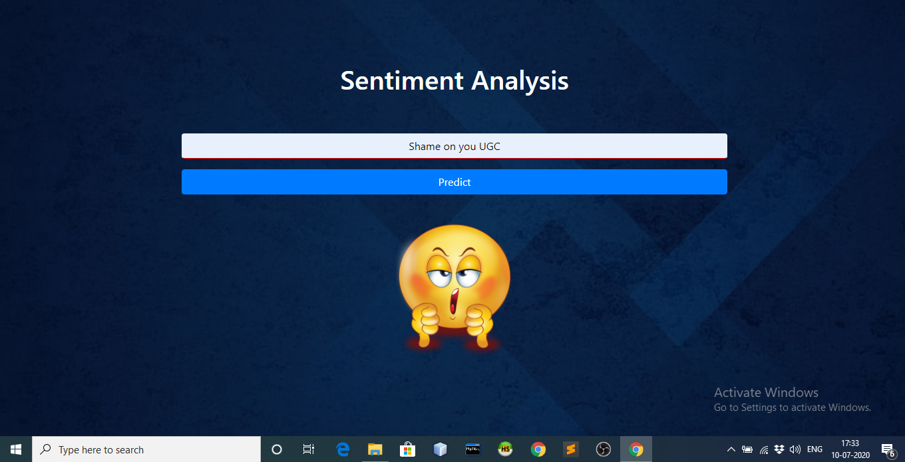

# llSPS-INT-3344-Sentiment-Analysis-of-twitter-data-Using-Deep-Learning

  
   

#### Category: Deep Learning

#### Skills Required:
- Python
- Python Web Frame works
- NLP

#### Project Description:

##### Description:
Twitter has grown in popularity during the past decades. It is now used by millions of users who share information about their daily life and their feelings. In order to automatically process and analyze these data, applications can rely on analysis methods such as sentiment analysis and topic modeling.Developing a program for sentiment analysis is an approach to be used to computationally measure customers' perceptions.

##### Solution :
The model takes the text as input, pre-processes the text and sends it to the neural network. The neural network classifies the text as 0 or 1 based on whether the text is negative or positive respectively. Using this the sentiment of the person who is sending the tweet can be understood and tweet can be analysed.

##### Demo
A working demo can be found at <a href="https://smartsentiment.herokuapp.com">https://smartsentiment.herokuapp.com/</a>

